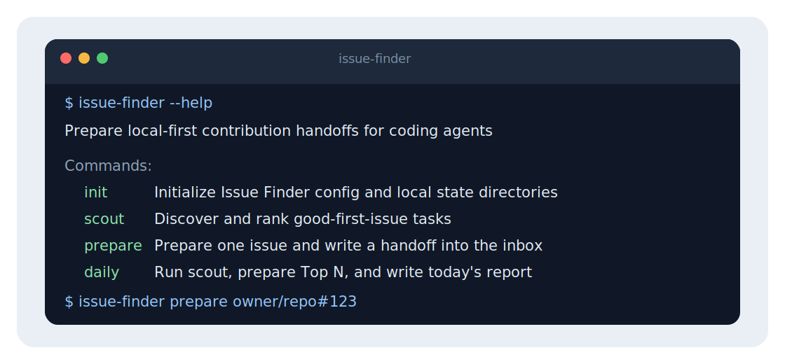

# Issue Finder

<p align="center">
  <strong>Issue Finder</strong> is local-first handoff prep for developers using coding agents.
</p>

<p align="center">
  
</p>

Issue Finder finds suitable GitHub issues, ranks them with local heuristics, prepares a safe workspace, and writes a structured handoff package for tools such as Codex, Cursor, Claude Code, and Cline. It also exposes a JSON tool contract so coding agents can list, assess, prepare, and read Issue Finder context through structured calls.

It stops before the risky parts: Issue Finder does not modify target repository source, install dependencies, run validation commands, commit, push, or create pull requests.

<p align="center">
  
</p>

---

## Quickstart

### Install Issue Finder

Install the published crate with Cargo:

```bash
cargo install issue-finder
```

The crate is named `issue-finder`; the installed command is `issue-finder`.

You can also install directly from this repository:

```bash
cargo install --git https://github.com/lifuyue/issue-finder
```

Prefer a prebuilt binary? Run the following on macOS or Linux:

```sh
curl -fsSL https://raw.githubusercontent.com/lifuyue/issue-finder/main/install.sh | sh
```

Or run the following on Windows:

```powershell
powershell -ExecutionPolicy Bypass -c "irm https://raw.githubusercontent.com/lifuyue/issue-finder/main/install.ps1 | iex"
```

You can also download the matching archive from the [latest GitHub Release](https://github.com/lifuyue/issue-finder/releases/latest):

- macOS Apple Silicon: `issue-finder-aarch64-apple-darwin.tar.gz`
- macOS Intel: `issue-finder-x86_64-apple-darwin.tar.gz`
- Linux x86_64: `issue-finder-x86_64-unknown-linux-gnu.tar.gz`
- Windows x86_64: `issue-finder-x86_64-pc-windows-msvc.zip`

Each archive contains an `issue-finder` executable. Put it somewhere on your `PATH`.

### Configure GitHub

Issue Finder needs Git and a GitHub token with read access:

```bash
export GITHUB_TOKEN="$(gh auth token)"
```

Then check local readiness:

```bash
issue-finder doctor
```

### Prepare your first handoff

```bash
issue-finder init
issue-finder scout --limit 10
issue-finder prepare owner/repo#123
issue-finder handoff <inbox-id> --print
```

For isolated local runs, keep generated state out of `~/.issue-finder`:

```bash
ISSUE_FINDER_HOME=/tmp/issue-finder-demo issue-finder doctor
```

### Use the JSON tool contract

Issue Finder v1 exposes a CLI JSON adapter for agent-facing tool calls:

```bash
issue-finder tools list
issue-finder tools call issue-finder.scout --arguments '{"limit":10}'
issue-finder tools call issue-finder.assess --arguments '{"issue":"owner/repo#123"}'
issue-finder tools call issue-finder.prepare --arguments '{"issue":"owner/repo#123"}'
issue-finder tools call issue-finder.read_context --arguments '{"handoffId":"<inbox-id>","section":"entry"}'
```

`tools call` prints a single JSON object on stdout. The four v1 tools are `issue-finder.scout`, `issue-finder.assess`, `issue-finder.prepare`, and `issue-finder.read_context`.

## Docs

- [**Usage guide**](./docs/usage.md)
- [**Agent-safe preparation runtime**](./docs/agent-safe-preparation-runtime.md)
- [**Rust design notes**](./docs/issue-finder-rust-design.md)
- [**Workflow design specs**](./docs/superpowers/specs/)
- [**Repository guidance for coding agents**](./AGENTS.md)

## Development

```bash
cargo test
cargo clippy --all-targets -- -D warnings
cargo fmt --all
```

## Release

Issue Finder `0.1.0` release assets are published by pushing a `v0.1.0` tag. Use this GitHub repository About text:

```text
Local-first handoff prep for developers using coding agents.
```
