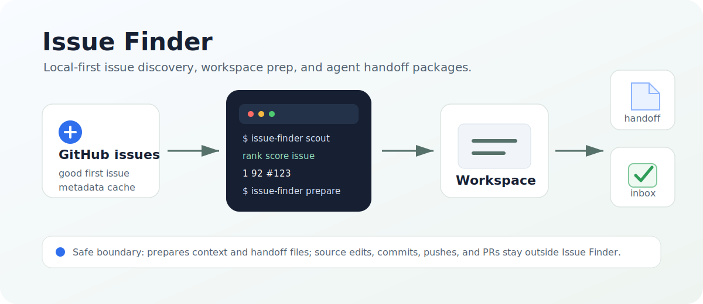

# Issue Finder

<p align="center">
  <a href="./README.md">English</a> | <a href="./README.zh-CN.md">简体中文</a>
</p>

<p align="center">
  <strong>Issue Finder</strong> 会发现值得交给编码代理处理的 GitHub issue，准备本地上下文，并在代码变更前停止。
</p>

<p align="center">
  
</p>

---

## 快速开始

### 安装 Issue Finder

```bash
cargo install issue-finder
```

如果希望主编码代理代为完成首次设置，可以给它这段提示词：

```text
帮我安装 cargo issue-finder 到本地并启动。请运行
`issue-finder profile bootstrap --json`，审阅报告中的技术栈、关键词和项目证据，
结合我的实际偏好去噪后，更新 `~/.issue-finder/config.toml` 的 `[profile]`。
不要把会话正文、密钥、系统提示或工具输出写进配置。完成后运行
`issue-finder doctor` 和 `issue-finder scout --limit 10` 验证。
```

然后配置 GitHub 访问并检查本地就绪状态：

```bash
export GITHUB_TOKEN="$(gh auth token)"
issue-finder init
issue-finder doctor
```

查找候选 issue 并准备交接：

```bash
issue-finder scout --limit 10
issue-finder scout --repo owner/repo --limit 10
issue-finder prepare owner/repo#123
issue-finder handoff <inbox-id> --print
```

Issue Finder 默认将本地状态写入 `~/.issue-finder`。使用 `ISSUE_FINDER_HOME=/tmp/issue-finder-demo` 进行隔离运行。

### 工具契约

Issue Finder 也为编码代理暴露 JSON 工具契约：

```bash
issue-finder tools list
issue-finder tools call issue-finder.scout --arguments '{"limit":10}'
issue-finder tools call issue-finder.scout --arguments '{"repo":"owner/repo","limit":10}'
```

## 文档

- [**使用指南**](./docs/usage.md)
- [**代理安全的准备运行时**](./docs/agent-safe-preparation-runtime.md)
- [**安全探测**](./docs/safe-probes.md)
- [**面向编码代理的仓库指南**](./AGENTS.md)

## 开发

```bash
cargo test
cargo clippy --all-targets -- -D warnings
cargo fmt --all
```

本仓库基于 [MIT License](./LICENSE) 授权。
